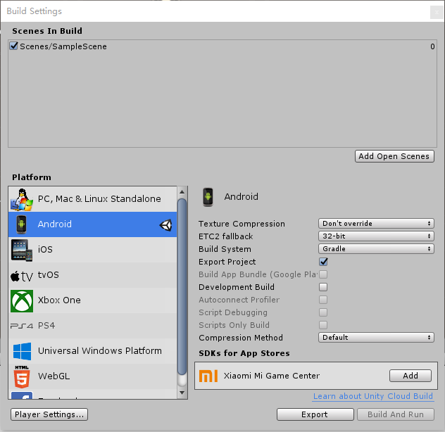
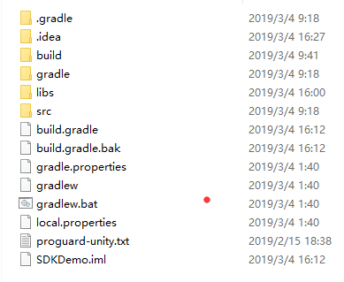

# **ElevateSDK DemoProject**

## Using latest version of Unity - 2018.3.6f1（Developers can use other versions）

* Developers need to add the following folders to their projects

    

* Due to many incompatibilities in the Unity package versions, it is recommended to export the Unity project to AndroidStudio, as shown below.

    

* The project structure described below:

    

* The following steps are very important：
  
  * After opening the project, add the interface function to the following code

    

    ``` bash
        // Return payment result
        @Override
        protected void onActivityResult(int requestCode, int resultCode, Intent data) {
            if (requestCode == PAY_REQUEST && resultCode == RESULT_OK){
                String tradelogNo = data.getStringExtra(TRADELOGS_NO);
                Log.d(TAG, "onActivityResult: " + tradelogNo);
                UnityPlayer.UnitySendMessage("ElevateObject","PurchaseResult", tradelogNo);
            }
        }

        // Unity interface.
        public void init(String appId, boolean isDev){
            SDKManager.init(this, appId, isDev);
        }

        public void purchase(String goodsNo, int count){
            try {
                Intent intent = new Intent(this, PaymentActivity.class);
                intent.putExtra(GOODS_NO, goodsNo);
                intent.putExtra(COUNT, count);
                startActivityForResult(intent, PAY_REQUEST);
            } catch (ActivityNotFoundException a) {
                Log.e(TAG, "Launch payment activity: " + a.getMessage());
            }
        }

        public void openLogin(){
            runOnUiThread(new Runnable() {
                @Override
                public void run() {
                    SDKManager.getInstance().openLogin();
                }
            });
        }

        public void getOrderInfo(final String tradelog){
            runOnUiThread(new Runnable() {
                @Override
                public void run() {
                    SDKManager.getInstance().getOrderInfo(tradelog);
                }
            });
        }

        public void queryByGoodsNo(final String goodsNo) {
            runOnUiThread(new Runnable() {
                @Override
                public void run() {
                    SDKManager.getInstance().queryByGoodsNo(goodsNo);
                }
            });
        }
    ```

  * Modify the AndroidManifest.xml file and add the following code under the Aplication node.

    ```bash
    <activity
        android:name="com.elevate.games.plugin.PaymentActivity"
        android:theme="@style/Theme.AppCompat.Light.NoActionBar">
      <intent-filter>
        <action android:name="android.intent.action.DEFAULT" />
        <category android:name="android.intent.category.DEFAULT"/>
      </intent-filter>
    </activity>

    <activity
        android:name="com.elevate.games.plugin.StripeActivity"
        android:theme="@style/Theme.AppCompat.Light.NoActionBar">
      <intent-filter>
        <action android:name="android.intent.action.DEFAULT" />
        <category android:name="android.intent.category.DEFAULT"/>
      </intent-filter>
    </activity>

    <activity
        android:name="com.elevate.games.plugin.WebActivity"
        android:theme="@style/Theme.AppCompat.Light.NoActionBar">
      <intent-filter>
        <action android:name="android.intent.action.DEFAULT" />
        <category android:name="android.intent.category.DEFAULT"/>
      </intent-filter>
    </activity>
    ```

  * Open build.gradle file，replace all the content with the following code

    ```bash
    // GENERATED BY UNITY. REMOVE THIS COMMENT TO PREVENT OVERWRITING WHEN EXPORTING AGAIN

    buildscript {
        repositories {
            google()
            jcenter()
            maven { url "https://jitpack.io" }
        }

        dependencies {
            classpath 'com.android.tools.build:gradle:3.2.0'
            classpath 'org.greenrobot:greendao-gradle-plugin:3.2.2'
        }
    }

    allprojects {
        repositories {
            google()
            jcenter()
            flatDir {
                dirs 'libs'
                maven { url "https://jitpack.io" }
            }
        }
    }

    apply plugin: 'com.android.application'


    dependencies {
        implementation fileTree(dir: 'libs', include: ['*.jar'])

        implementation 'com.android.support:appcompat-v7:26.1.0'
        implementation 'com.android.support:design:26.1.0'
        implementation 'com.android.support.constraint:constraint-layout:1.1.3'
        implementation 'com.android.support:recyclerview-v7:26.1.0'
        implementation 'com.android.support:support-v4:26.1.0'
        /* WebTool */
        implementation 'com.just.agentweb:agentweb:4.0.2'
        /* TextTool */
        implementation 'me.codeboy.android:align-text-view:2.3.2'
        /* Needed for RxAndroid */
        implementation 'io.reactivex:rxandroid:1.2.1'
        implementation 'io.reactivex:rxjava:1.3.0'
        /* Needed for Rx Bindings on views */
        implementation 'com.jakewharton.rxbinding:rxbinding:1.0.1'
        /* Used for server calls */
        implementation 'com.squareup.okio:okio:2.2.1'
        implementation 'com.squareup.retrofit2:retrofit:2.5.0'
        /* Used to make Retrofit easier and GSON & Rx-compatible*/
        implementation 'com.google.code.gson:gson:2.8.5'
        implementation 'com.squareup.retrofit2:adapter-rxjava:2.3.0'
        implementation 'com.squareup.retrofit2:converter-gson:2.5.0'
        /* Used to debug your Retrofit connections */
        implementation 'com.squareup.okhttp3:logging-interceptor:3.12.1'
        /* HttpCookies */
        implementation 'com.github.franmontiel:PersistentCookieJar:v1.0.1'
        /* Stripe */
        implementation 'com.stripe:stripe-android:6.1.2'
        /*database */
        implementation 'org.greenrobot:greendao:3.2.2'
        implementation 'net.zetetic:android-database-sqlcipher:4.0.1'
        implementation 'de.hdodenhof:circleimageview:2.2.0'

        implementation(name: 'plugin', ext: 'aar')
    }

    android {
        compileSdkVersion 26

        defaultConfig {
            minSdkVersion 16
            targetSdkVersion 26
            applicationId 'com.multiverse.demo'
            ndk {
                abiFilters 'armeabi-v7a', 'x86'
            }
            versionCode 1
            versionName '0.1'
        }

        lintOptions {
            abortOnError false
        }

        aaptOptions {
            noCompress = ['.unity3d', '.ress', '.resource', '.obb']
        }

        buildTypes {
            debug {
                minifyEnabled false
                useProguard false
                proguardFiles getDefaultProguardFile('proguard-android.txt'), 'proguard-unity.txt'
                jniDebuggable true
            }
            release {
                minifyEnabled false
                useProguard false
                proguardFiles getDefaultProguardFile('proguard-android.txt'), 'proguard-unity.txt'
                signingConfig signingConfigs.debug
            }
        }

        packagingOptions {
            doNotStrip '*/armeabi-v7a/*.so'
            doNotStrip '*/x86/*.so'
        }

        bundle {
            language {
                enableSplit = false
            }
            density {
                enableSplit = false
            }
            abi {
                enableSplit = true
            }
        }
    }
    ```

  * Next, change the applicationId to your preferred package name, then add plugin.aar to the libs folder.

    

* Finally press "compile"

## Unity Interface Description

* Default call SDK initialize，open Login page
  
    ```bash
    private void InitSDK(bool isDev);
    ```

* Open the login page and log in again.

    ```bash
    public void OpenLogin();
    ```

* In the in-app purchases interface pass the product id (goodsNo) and quantity  (int count, ）（set the number of non-consumable items to 1 ）

    ```bash
    public void Purchase(string goodsNo, int count);
    ```

* To check the order details  use the OrderNo you get after successful payment

    ```bash
    public void GetOrderInfo(string orderNo);
    ```

* Check if the product has been purchased using its product ID

    ```bash
    public void QueryByGoodsNo(string goodsNo);
    ```